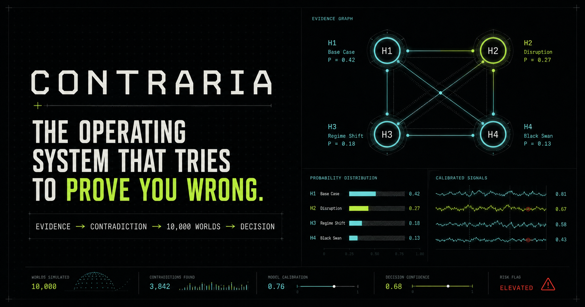
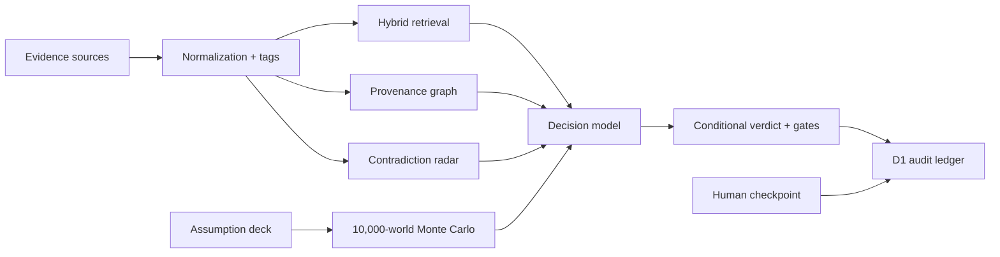

# CONTRARIA

> The decision-intelligence operating system that tries to prove you wrong before reality does.



CONTRARIA turns fragmented evidence into an inspectable decision: supporting claims, counterevidence, contradictions, uncertainty, simulated outcomes, explicit launch gates, and an append-only audit trail. The included NovaCell workspace asks whether a fictional energy-storage company should enter Germany in Q1 2027. It is a complete, executable reference product—not a static dashboard.

[](https://github.com/shauryamalhotra957-wq/contraria-decision-os/actions/workflows/ci.yml)


## Why this exists

Most AI software optimizes for a persuasive answer. High-stakes decisions need the opposite incentives: attributable evidence, visible disagreement, calibrated uncertainty, disconfirming tests, and a human-owned commit point.

CONTRARIA operationalizes that idea in one decision room:

- **Hybrid retrieval** combines BM25, 96-dimensional signed feature-hash embeddings, reliability priors, and reciprocal-rank fusion. It works locally, has no hidden API dependency, and always returns provenance.
- **Contradiction radar** keeps material disagreements visible instead of flattening them into a single summary.
- **Counterfactual engine** evaluates 10,000 correlated worlds, including regulatory delay, material spikes, thermal remediation, competitor moves, subsidy lapse, manufacturing yield, and paid conversion.
- **Epistemic confidence** separates source quality, contradiction load, stability, and reversibility from a simplistic model score.
- **Decision gates** convert analysis into falsifiable release criteria.
- **Immutable trace** stores operator actions, model runs, and checkpoints in Cloudflare D1 with short SHA-256 checksums.
- **Decision memo export** produces a board-ready, source-aware Markdown artifact from the live model state.

## Product surfaces

| Surface | What it does |
| --- | --- |
| Decision | Conditional verdict, launch gates, uncertainty, scenario frontier, and evidence pulse |
| Evidence | Interactive provenance graph, hypothesis inspection, source reliability, and contradiction clusters |
| Worlds | Live assumption deck, 10,000-run Monte Carlo engine, NPV distribution, sensitivity, and failure-mode mass |
| Trace | D1-backed event stream, checksums, source lineage, model identity, and human checkpoints |
| Interrogate | Keyboard-first RAG search with grounded synthesis and direct evidence navigation |

Keyboard shortcuts: `⌘/Ctrl + K` focuses evidence interrogation; `1–4` switches between product surfaces; `Esc` closes the retrieval drawer.

## Architecture



The web layer is React 19 + TypeScript on the vinext/Vite runtime. Cloudflare D1 stores durable audit events. Domain engines are framework-independent TypeScript and tested directly. See [Architecture](./docs/ARCHITECTURE.md), [API reference](./docs/API.md), and the [Model card](./docs/MODEL_CARD.md).

## Run locally

Requirements: Node.js 22.13+ and pnpm 11+.

```bash
pnpm install
pnpm dev
```

Open `http://localhost:3000`. The Cloudflare development runtime provisions the local `DB` binding from `.openai/hosting.json`.

Useful commands:

```bash
pnpm lint          # static analysis
pnpm test          # retrieval + simulation tests
pnpm build         # production worker build
pnpm test:render   # server-rendered product assertions
pnpm db:generate   # generate D1 migration from Drizzle schema
```

## API

```text
GET  /api/decision   complete decision workspace and calibrated baseline
POST /api/search     hybrid evidence retrieval
POST /api/simulate   bounded Monte Carlo scenario execution
GET  /api/ledger     ordered audit history
POST /api/ledger     append a validated audit event
```

Every input is bounded or length-limited, retrieval is deterministic, simulation seeds are returned, and the ledger never accepts arbitrary SQL. Examples and response shapes are in [docs/API.md](./docs/API.md).

## Validation

The repository ships two validation layers:

1. Engine tests prove tokenizer behavior, embedding normalization, retrieval relevance and ordering, simulation determinism, scenario monotonicity, and hostile-input bounds.
2. Render tests build the production worker, execute server rendering, assert the full decision room and metadata, and reject any starter or preview residue.

The CI workflow runs lint, engine tests, a production build, and render tests on every push and pull request.

## Data and safety

The NovaCell company, documents, people, and commercial numbers are synthetic. They are designed to demonstrate the system without leaking or implying real company information. The simulation is a decision-support model, not financial advice, and its outputs are only as valid as its assumptions. CONTRARIA exposes those assumptions precisely so a human can challenge them.

The product design is informed by NIST's emphasis on governance, provenance, testing, transparency, and human accountability in the [AI Risk Management Framework](https://airc.nist.gov/) and [Generative AI Profile](https://www.nist.gov/publications/artificial-intelligence-risk-management-framework-generative-artificial-intelligence). Its explicit counterfactual surface also reflects research showing that counterfactual explanations can improve people's own decisions in tested settings ([Celar & Byrne, 2023](https://research.google/pubs/how-people-reason-with-counterfactual-and-causal-explanations-for-artificial-intelligence-decisions-in-familiar-and-unfamiliar-domains/)).

## Repository guide

```text
app/                  product UI and route handlers
db/                   Drizzle schema, D1 access, runtime bootstrap
drizzle/              generated SQL migration and schema snapshot
lib/contraria/        corpus, retrieval engine, simulation, domain types
tests/                engine and server-render validation
docs/                 architecture, API, model card, decision memo
public/og.png          purpose-built social preview
```

## License

MIT © 2026. See [LICENSE](./LICENSE).
