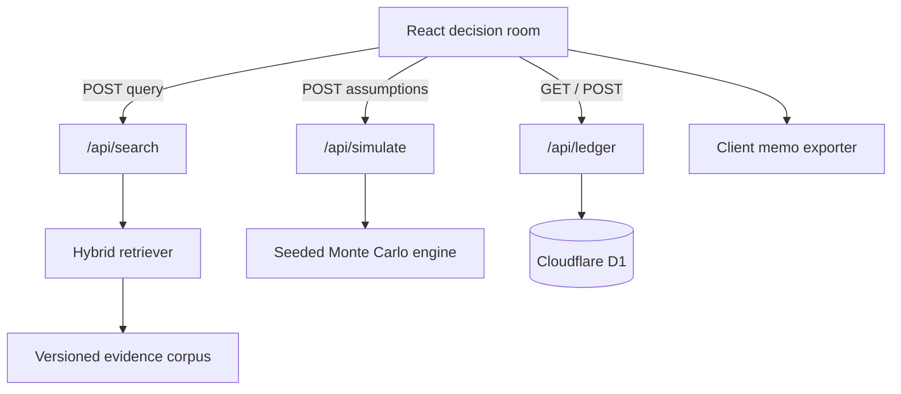

# CONTRARIA architecture

## Design objective

CONTRARIA is built around a strict boundary: evidence, inference, simulation, and authorization are distinct artifacts. The UI may compose them, but it never pretends that a generated narrative is the source of truth.

## Runtime topology

### Evidence layer

The demonstration corpus contains 16 source records across internal, technical, market, regulatory, and customer modalities. Each record includes source identity, observation time, stance, reliability, and tags. Claims and hypotheses reference stable evidence IDs.

### Retrieval layer

The retriever uses two intentionally inspectable rankings:

1. Okapi BM25 over normalized title, body, source, and tags.
2. Cosine similarity over deterministic 96-dimensional signed feature-hash embeddings built from tokens and character trigrams.

The two rankings are combined by reciprocal-rank fusion with a small, explicit reliability prior. The engine is zero-dependency, deterministic, and suitable as a local baseline. A production dense-embedding adapter can replace only the semantic ranker without changing provenance or response contracts.

### Contradiction layer

Contradictions are first-class domain records. Each cluster references exactly two or more source IDs, a human-readable delta, a severity, and the unresolved implication. This prevents the synthesis layer from silently choosing a side.

### World model

The Monte Carlo engine samples five operator-controlled variables and four endogenous shocks. It returns distributions, not point forecasts:

- positive-NPV probability;
- survival probability under a cash-floor policy;
- P10/P50/P90 NPV and break-even month;
- histogram buckets;
- global Pearson sensitivity;
- ranked failure-mode mass.

Runs are deterministic for a fixed seed. Inputs are clamped to documented domains. The API caps iterations at 50,000.

### Audit layer

The D1 schema holds decisions, evidence, scenarios, and append-only audit events. The current product persists the event stream; the other tables establish the normalized persistence contract for multi-workspace extension. Runtime initialization uses one prepared statement per SQL operation and generated Drizzle migrations are committed.

### Failure behavior

- Retrieval rejects queries shorter than two characters and caps result counts.
- Simulation fills missing assumptions from a versioned baseline and clamps hostile values.
- Ledger writes cap actor, action, and detail lengths and never interpolate SQL.
- If ledger persistence is temporarily unavailable, the decision and simulation surfaces remain usable and the UI reports no false success.
- All model runs return their seed and model identifier.

## Trust boundaries

CONTRARIA does not make network model calls. No third-party LLM sees evidence. The generated synthesis in the search drawer is template-based and grounded in retrieved records. This is deliberate: the demo's trust story can be inspected end-to-end without credentials or hidden prompts.
